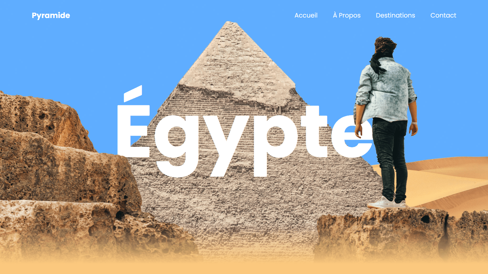

<div align="center">  
  <a href="https://background-parallax-egypt.netlify.app/" target="_blank">  
      
  </a>  
  </br></br>  
  <h3 align="center">🐪 Animation Parallax de Fond &nbsp;–&nbsp; Égypte</h3>  
</div>

## <br /> 📌 Sommaire

&nbsp;&nbsp;&nbsp; 🎨 &nbsp; [**Introduction**](#introduction)<br />
&nbsp;&nbsp;&nbsp; 🛠️ &nbsp; [**Technologies**](#technologies)<br />
&nbsp;&nbsp;&nbsp; 🎯 &nbsp; [**Fonctionnalités**](#fonctionnalités)<br />
&nbsp;&nbsp;&nbsp; 🚀 &nbsp; [**Installation**](#installation)<br />

## <br /> <a name="introduction">🎨 Introduction</a>

Plongez dans un paysage égyptien animé, où cinq calques (ciel, pyramide, rocher, voyageur, titre) défilent à des vitesses variées pour un effet parallax immersif.

Le mot « Égypte » glisse latéralement avec fluidité, toujours visible à l’écran. L’animation au scroll est optimisée via **requestAnimationFrame** pour un rendu fluide, même sur mobile.

## <br /> <a name="technologies">🛠️ Technologies</a>

- HTML5 sémantique et accessible
- CSS3 moderne avec clamp, media queries, reset minimal
- JavaScript ES6 clair et modulaire
- [Remix Icons](https://remixicon.com/) pour les icônes vectorielles
- API [requestAnimationFrame](https://developer.mozilla.org/en-US/docs/Web/API/Window/requestAnimationFrame) pour des animations fluides

## <br /> <a name="fonctionnalités">🎯 Fonctionnalités</a>

- Parallax multi-couches fluide en X et Y déclenché au scroll
- Titre animé en profondeur avec translation synchronisée
- Menu mobile responsive avec ouverture et fermeture fluide
- Affichage optimisé sur mobile, tablette et desktop
- Code léger en Vanilla JS, sans dépendances externes
- Palette harmonieuse avec des tons sable et brun antique
- Chargement propre, sans flash ni décalage de contenu
- Accessibilité avec titres, alt images et focus clair

## <br /> <a name="installation">🚀 Installation</a>

### ✅ Prérequis

- [Google Chrome](https://www.google.com/) &nbsp;—&nbsp; Navigateur moderne
- [Visual Studio Code](https://code.visualstudio.com/) &nbsp;—&nbsp; Éditeur de code
- [Live Server](https://marketplace.visualstudio.com/items?itemName=ritwickdey.LiveServer) &nbsp;—&nbsp; Extension VS Code

### 📥 Cloner le projet

```bash
git clone https://github.com/ValentinMadiot/background-parallax-egypt_js
cd background-parallax-egypt_js
```

### ▶️ Lancer le projet

Il suffit d’ouvrir le fichier `index.html` dans un navigateur, ou d’utiliser l’extension **Live Server** sur VS Code pour un aperçu dynamique.
